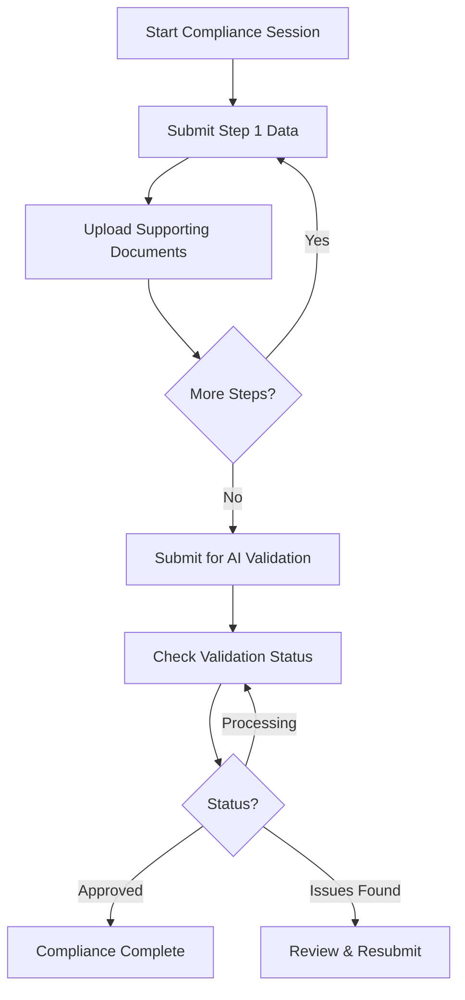

# AI-Based Self Compliance API Documentation

## Overview
This document describes the AI-powered Self Compliance API endpoints. The system allows NOC holders to complete compliance verification through an intelligent, step-by-step process with automated AI validation of documents and responses.

**Key Features:**
- ✅ No authentication required for public access
- ✅ AI-powered document verification
- ✅ Step-by-step guided compliance workflow
- ✅ Automated validation and scoring
- ✅ Real-time status tracking

---

## API Workflow



---

## Table of Contents
1. [Start Compliance Session](#1-start-compliance-session)
2. [Submit Step Data](#2-submit-step-data)
3. [Upload Document](#3-upload-document)
4. [Submit for AI Validation](#4-submit-for-ai-validation)
5. [Check Compliance Status](#5-check-compliance-status)
6. [Get Compliance Details](#6-get-compliance-details)

---

## 1. Start Compliance Session

Initialize a new compliance verification session for an application.

### Endpoint
```
POST /api/self-compliance/start
```

### Authentication
**Not Required** - Public endpoint

### Request Body
| Field | Type | Required | Description |
|-------|------|----------|-------------|
| applicationId | string | Yes | Application/NOC ID or Number |
| applicationType | string | No | Type of application (e.g., "NOC", "PERMIT") |

### Request Example
```bash
curl -X POST http://localhost:3000/api/self-compliance/start \
  -H "Content-Type: application/json" \
  -d '{
    "applicationId": "21-4/3482/GJ/IND/2021",
    "applicationType": "NOC"
  }'
```

### PowerShell Example
```powershell
$body = @{
    applicationId = "21-4/3482/GJ/IND/2021"
    applicationType = "NOC"
} | ConvertTo-Json

$response = Invoke-RestMethod -Uri "http://localhost:3000/api/self-compliance/start" `
    -Method POST `
    -ContentType "application/json" `
    -Body $body

$response | ConvertTo-Json -Depth 10
```

### Success Response (201 Created)
```json
{
    "success": true,
    "data": {
        "complianceId": "COMP-2026-00123",
        "applicationNumber": "21-4/3482/GJ/IND/2021",
        "nocNumber": "CGWA/NOC/IND/ORIG/2021/12345",
        "applicantName": "Sunlight Industries Pvt Ltd",
        "status": "IN_PROGRESS",
        "currentStep": 1,
        "totalSteps": 5,
        "createdAt": "2026-01-11T14:00:00.000Z",
        "expiresAt": "2026-01-18T14:00:00.000Z",
        "steps": [
            {
                "stepNumber": 1,
                "title": "Digital Flow Meters",
                "description": "Verify installation and calibration of digital flow meters",
                "required": true,
                "status": "PENDING"
            },
            {
                "stepNumber": 2,
                "title": "Water Extraction Data",
                "description": "Provide quarterly extraction records",
                "required": true,
                "status": "PENDING"
            },
            {
                "stepNumber": 3,
                "title": "Rainwater Harvesting",
                "description": "Confirm rainwater harvesting structure status",
                "required": true,
                "status": "PENDING"
            },
            {
                "stepNumber": 4,
                "title": "Environmental Compliance",
                "description": "Verify environmental safety measures",
                "required": false,
                "status": "PENDING"
            },
            {
                "stepNumber": 5,
                "title": "Document Upload",
                "description": "Upload supporting documents and reports",
                "required": true,
                "status": "PENDING"
            }
        ]
    },
    "message": "Compliance session started successfully"
}
```

### Error Responses

**404 Not Found**
```json
{
    "success": false,
    "error": {
        "code": "APPLICATION_NOT_FOUND",
        "message": "Application not found or NOC not issued"
    }
}
```

**409 Conflict**
```json
{
    "success": false,
    "error": {
        "code": "ACTIVE_SESSION_EXISTS",
        "message": "An active compliance session already exists",
        "data": {
            "existingComplianceId": "COMP-2026-00120"
        }
    }
}
```

---

## 2. Submit Step Data

Submit responses for a specific compliance step.

### Endpoint
```
POST /api/self-compliance/:complianceId/step
```

### Authentication
**Not Required** - Public endpoint

### Path Parameters
| Parameter | Type | Required | Description |
|-----------|------|----------|-------------|
| complianceId | string | Yes | Compliance session ID |

### Request Body
| Field | Type | Required | Description |
|-------|------|----------|-------------|
| step | number | Yes | Step number (1-5) |
| responses | object | Yes | Step-specific responses |

### Step 1 Example - Digital Flow Meters
```bash
curl -X POST http://localhost:3000/api/self-compliance/COMP-2026-00123/step \
  -H "Content-Type: application/json" \
  -d '{
    "step": 1,
    "responses": {
      "digitalFlowMetersInstalled": true,
      "numberOfMeters": 3,
      "meterManufacturer": "ABC Meters Ltd",
      "meterModel": "DFM-500",
      "meterCalibrationDone": true,
      "lastCalibrationDate": "2025-12-15",
      "telemetryEnabled": true,
      "remarks": "All meters installed and calibrated as per BIS standards"
    }
  }'
```

### Step 2 Example - Water Extraction Data
```bash
curl -X POST http://localhost:3000/api/self-compliance/COMP-2026-00123/step \
  -H "Content-Type: application/json" \
  -d '{
    "step": 2,
    "responses": {
      "reportingYear": "2025-2026",
      "q1Extraction": 45000,
      "q2Extraction": 43000,
      "q3Extraction": 44500,
      "q4Extraction": 42000,
      "totalAnnualExtraction": 174500,
      "approvedLimit": 180000,
      "unit": "m³",
      "withinLimit": true,
      "remarks": "Extraction maintained below approved limit"
    }
  }'
```

### PowerShell Example
```powershell
$complianceId = "COMP-2026-00123"
$body = @{
    step = 1
    responses = @{
        digitalFlowMetersInstalled = $true
        numberOfMeters = 3
        meterManufacturer = "ABC Meters Ltd"
        meterModel = "DFM-500"
        meterCalibrationDone = $true
        lastCalibrationDate = "2025-12-15"
        telemetryEnabled = $true
        remarks = "All meters installed and calibrated"
    }
} | ConvertTo-Json

$response = Invoke-RestMethod -Uri "http://localhost:3000/api/self-compliance/$complianceId/step" `
    -Method POST `
    -ContentType "application/json" `
    -Body $body

$response | ConvertTo-Json -Depth 10
```

### Success Response (200 OK)
```json
{
    "success": true,
    "data": {
        "complianceId": "COMP-2026-00123",
        "step": 1,
        "status": "COMPLETED",
        "score": 100,
        "feedback": "All required information provided correctly",
        "nextStep": 2,
        "progress": {
            "completedSteps": 1,
            "totalSteps": 5,
            "percentComplete": 20
        }
    },
    "message": "Step 1 data submitted successfully"
}
```

### Error Responses

**400 Bad Request**
```json
{
    "success": false,
    "error": {
        "code": "VALIDATION_ERROR",
        "message": "Invalid step data",
        "details": {
            "numberOfMeters": "Number of meters must match NOC approval",
            "lastCalibrationDate": "Calibration date cannot be in the future"
        }
    }
}
```

---

## 3. Upload Document

Upload supporting documents for compliance verification.

### Endpoint
```
POST /api/self-compliance/:complianceId/upload
```

### Authentication
**Not Required** - Public endpoint

### Content Type
`multipart/form-data`

### Path Parameters
| Parameter | Type | Required | Description |
|-----------|------|----------|-------------|
| complianceId | string | Yes | Compliance session ID |

### Form Fields
| Field | Type | Required | Description |
|-------|------|----------|-------------|
| file | file | Yes | Document file (PDF, JPG, PNG) |
| documentType | string | Yes | Type of document being uploaded |
| step | number | No | Associated step number |
| description | string | No | Document description |

### Document Types
- `FLOW_METER_CALIBRATION` - Flow meter calibration certificate
- `EXTRACTION_REPORT` - Quarterly/Annual extraction data report
- `RAINWATER_HARVESTING` - RWH structure photos/certificates
- `ENVIRONMENTAL_CLEARANCE` - Environmental compliance certificate
- `ANNUAL_REPORT` - Comprehensive annual compliance report
- `OTHER` - Other supporting documents

### Request Example
```bash
curl -X POST http://localhost:3000/api/self-compliance/COMP-2026-00123/upload \
  -F "file=@flow_meter_certificate.pdf" \
  -F "documentType=FLOW_METER_CALIBRATION" \
  -F "step=1" \
  -F "description=BIS certified calibration report"
```

### PowerShell Example
```powershell
$complianceId = "COMP-2026-00123"
$filePath = "C:\Documents\flow_meter_certificate.pdf"

$form = @{
    file = Get-Item -Path $filePath
    documentType = "FLOW_METER_CALIBRATION"
    step = "1"
    description = "BIS certified calibration report"
}

$response = Invoke-RestMethod -Uri "http://localhost:3000/api/self-compliance/$complianceId/upload" `
    -Method POST `
    -Form $form

$response | ConvertTo-Json -Depth 10
```

### Success Response (200 OK)
```json
{
    "success": true,
    "data": {
        "documentId": "DOC-2026-00456",
        "complianceId": "COMP-2026-00123",
        "fileName": "flow_meter_certificate.pdf",
        "fileSize": 245678,
        "documentType": "FLOW_METER_CALIBRATION",
        "uploadedAt": "2026-01-11T14:15:00.000Z",
        "fileUrl": "https://storage.example.com/compliance/DOC-2026-00456.pdf",
        "aiVerification": {
            "status": "PROCESSING",
            "estimatedTime": "2-3 minutes"
        }
    },
    "message": "Document uploaded successfully and queued for AI verification"
}
```

### Error Responses

**400 Bad Request - Invalid File**
```json
{
    "success": false,
    "error": {
        "code": "INVALID_FILE_TYPE",
        "message": "Only PDF, JPG, and PNG files are allowed"
    }
}
```

**413 Payload Too Large**
```json
{
    "success": false,
    "error": {
        "code": "FILE_TOO_LARGE",
        "message": "File size exceeds 10MB limit"
    }
}
```

---

## 4. Submit for AI Validation

Submit the completed compliance session for AI-powered validation.

### Endpoint
```
POST /api/self-compliance/:complianceId/submit
```

### Authentication
**Not Required** - Public endpoint

### Path Parameters
| Parameter | Type | Required | Description |
|-----------|------|----------|-------------|
| complianceId | string | Yes | Compliance session ID |

### Request Body
```json
{
    "finalRemarks": "All compliance requirements fulfilled for year 2025-2026",
    "contactEmail": "contact@sunlightind.com"
}
```

### Request Example
```bash
curl -X POST http://localhost:3000/api/self-compliance/COMP-2026-00123/submit \
  -H "Content-Type: application/json" \
  -d '{
    "finalRemarks": "All compliance requirements fulfilled",
    "contactEmail": "contact@sunlightind.com"
  }'
```

### PowerShell Example
```powershell
$complianceId = "COMP-2026-00123"
$body = @{
    finalRemarks = "All compliance requirements fulfilled for year 2025-2026"
    contactEmail = "contact@sunlightind.com"
} | ConvertTo-Json

$response = Invoke-RestMethod -Uri "http://localhost:3000/api/self-compliance/$complianceId/submit" `
    -Method POST `
    -ContentType "application/json" `
    -Body $body

$response | ConvertTo-Json -Depth 10
```

### Success Response (200 OK)
```json
{
    "success": true,
    "data": {
        "complianceId": "COMP-2026-00123",
        "submittedAt": "2026-01-11T14:30:00.000Z",
        "status": "SUBMITTED_FOR_VALIDATION",
        "validationStatus": "QUEUED",
        "estimatedCompletionTime": "15-20 minutes",
        "acknowledgmentNumber": "ACK-AI-2026-00123",
        "trackingUrl": "http://localhost:3000/api/self-compliance/COMP-2026-00123/status"
    },
    "message": "Compliance submitted for AI validation. You will receive results shortly."
}
```

### Error Responses

**400 Bad Request - Incomplete Steps**
```json
{
    "success": false,
    "error": {
        "code": "INCOMPLETE_COMPLIANCE",
        "message": "Cannot submit - required steps are incomplete",
        "details": {
            "missingSteps": [2, 5],
            "missingDocuments": ["EXTRACTION_REPORT", "ANNUAL_REPORT"]
        }
    }
}
```

---

## 5. Check Compliance Status

Check the current status and AI validation results.

### Endpoint
```
GET /api/self-compliance/:complianceId/status
```

### Authentication
**Not Required** - Public endpoint

### Path Parameters
| Parameter | Type | Required | Description |
|-----------|------|----------|-------------|
| complianceId | string | Yes | Compliance session ID |

### Request Example
```bash
curl -X GET http://localhost:3000/api/self-compliance/COMP-2026-00123/status
```

### PowerShell Example
```powershell
$complianceId = "COMP-2026-00123"
$response = Invoke-RestMethod -Uri "http://localhost:3000/api/self-compliance/$complianceId/status" `
    -Method GET

$response | ConvertTo-Json -Depth 10
```

### Success Response - Processing (200 OK)
```json
{
    "success": true,
    "data": {
        "complianceId": "COMP-2026-00123",
        "status": "VALIDATING",
        "overallProgress": 75,
        "validationStage": "AI_DOCUMENT_ANALYSIS",
        "estimatedTimeRemaining": "5 minutes",
        "validationSteps": [
            {
                "step": "Document Upload Verification",
                "status": "COMPLETED",
                "result": "PASSED"
            },
            {
                "step": "Data Consistency Check",
                "status": "COMPLETED",
                "result": "PASSED"
            },
            {
                "step": "AI Document Analysis",
                "status": "IN_PROGRESS",
                "progress": 60
            },
            {
                "step": "Compliance Score Calculation",
                "status": "PENDING"
            }
        ]
    }
}
```

### Success Response - Completed (200 OK)
```json
{
    "success": true,
    "data": {
        "complianceId": "COMP-2026-00123",
        "status": "COMPLETED",
        "result": "APPROVED",
        "validationCompletedAt": "2026-01-11T14:45:00.000Z",
        "overallScore": 95,
        "scoreBreakdown": {
            "flowMeterCompliance": 100,
            "waterExtractionCompliance": 98,
            "rainwaterHarvesting": 90,
            "documentationQuality": 92
        },
        "aiFindings": {
            "strengths": [
                "All digital flow meters properly installed and calibrated",
                "Water extraction maintained well below approved limit",
                "Comprehensive documentation provided"
            ],
            "areasOfImprovement": [
                "Consider upgrading to latest telemetry system",
                "Rainwater harvesting capacity could be increased"
            ],
            "criticalIssues": []
        },
        "certificateUrl": "https://storage.example.com/certificates/COMP-2026-00123.pdf",
        "validityPeriod": "2026-01-11 to 2027-01-11",
        "nextComplianceDue": "2027-01-15T00:00:00.000Z"
    },
    "message": "Compliance validation completed successfully"
}
```

### Success Response - Issues Found (200 OK)
```json
{
    "success": true,
    "data": {
        "complianceId": "COMP-2026-00123",
        "status": "COMPLETED",
        "result": "NEEDS_REVIEW",
        "validationCompletedAt": "2026-01-11T14:45:00.000Z",
        "overallScore": 72,
        "issues": [
            {
                "severity": "HIGH",
                "category": "WATER_EXTRACTION",
                "description": "Extraction data shows 5% excess in Q3",
                "step": 2,
                "recommendation": "Provide explanation or corrective action plan"
            },
            {
                "severity": "MEDIUM",
                "category": "DOCUMENTATION",
                "description": "Flow meter calibration certificate appears expired",
                "step": 1,
                "recommendation": "Upload updated calibration certificate"
            }
        ],
        "actionRequired": "RESUBMIT",
        "resubmissionDeadline": "2026-01-18T00:00:00.000Z"
    },
    "message": "Compliance validation identified issues requiring attention"
}
```

---

## 6. Get Compliance Details

Retrieve complete details of a compliance session.

### Endpoint
```
GET /api/self-compliance/:complianceId/details
```

### Authentication
**Not Required** - Public endpoint

### Request Example
```bash
curl -X GET http://localhost:3000/api/self-compliance/COMP-2026-00123/details
```

### Success Response (200 OK)
```json
{
    "success": true,
    "data": {
        "complianceId": "COMP-2026-00123",
        "applicationNumber": "21-4/3482/GJ/IND/2021",
        "nocNumber": "CGWA/NOC/IND/ORIG/2021/12345",
        "applicantName": "Sunlight Industries Pvt Ltd",
        "status": "COMPLETED",
        "createdAt": "2026-01-11T14:00:00.000Z",
        "submittedAt": "2026-01-11T14:30:00.000Z",
        "completedAt": "2026-01-11T14:45:00.000Z",
        "steps": [
            {
                "stepNumber": 1,
                "title": "Digital Flow Meters",
                "status": "COMPLETED",
                "responses": { /* step 1 data */ },
                "documents": [
                    {
                        "documentId": "DOC-2026-00456",
                        "fileName": "flow_meter_certificate.pdf",
                        "fileUrl": "https://storage.example.com/..."
                    }
                ]
            }
            // ... other steps
        ],
        "validationResult": {
            "result": "APPROVED",
            "score": 95,
            "certificateUrl": "https://storage.example.com/certificates/..."
        }
    }
}
```

---

## Data Models

### Compliance Session
```javascript
{
    complianceId: String,
    applicationId: String,
    applicationNumber: String,
    nocNumber: String,
    applicantName: String,
    status: Enum ['IN_PROGRESS', 'SUBMITTED_FOR_VALIDATION', 'VALIDATING', 'COMPLETED', 'EXPIRED'],
    result: Enum ['APPROVED', 'NEEDS_REVIEW', 'REJECTED'],
    currentStep: Number,
    totalSteps: Number,
    createdAt: Date,
    submittedAt: Date,
    completedAt: Date,
    expiresAt: Date,
    overallScore: Number (0-100)
}
```

### Step Response
```javascript
{
    step: Number,
    responses: Object, // Step-specific data
    status: Enum ['PENDING', 'COMPLETED', 'NEEDS_REVISION'],
    score: Number,
    feedback: String
}
```

---

## AI Validation Process

### Validation Stages
1. **Document Upload Verification** (30 seconds)
   - File integrity check
   - Format validation
   - Metadata extraction

2. **Data Consistency Check** (1 minute)
   - Cross-reference step responses
   - Verify against NOC conditions
   - Check calculation accuracy

3. **AI Document Analysis** (5-10 minutes)
   - OCR and text extraction
   - Certificate authenticity check
   - Compliance parameter extraction
   - Pattern recognition for anomalies

4. **Compliance Score Calculation** (1 minute)
   - Weighted scoring across all parameters
   - Risk assessment
   - Final recommendation generation

### Scoring Criteria
- **90-100**: Excellent compliance, auto-approved
- **75-89**: Good compliance, may need minor clarifications
- **60-74**: Moderate compliance, requires review
- **Below 60**: Poor compliance, likely rejection

---

## PowerShell Testing Script

Complete workflow test:

```powershell
# 1. Start Session
$startResponse = Invoke-RestMethod -Uri "http://localhost:3000/api/self-compliance/start" `
    -Method POST `
    -ContentType "application/json" `
    -Body (@{
        applicationId = "21-4/3482/GJ/IND/2021"
    } | ConvertTo-Json)

$complianceId = $startResponse.data.complianceId
Write-Host "Started compliance session: $complianceId"

# 2. Submit Step 1
$step1Response = Invoke-RestMethod -Uri "http://localhost:3000/api/self-compliance/$complianceId/step" `
    -Method POST `
    -ContentType "application/json" `
    -Body (@{
        step = 1
        responses = @{
            digitalFlowMetersInstalled = $true
            numberOfMeters = 3
            meterCalibrationDone = $true
            remarks = "All installed"
        }
    } | ConvertTo-Json)

Write-Host "Step 1 completed: $($step1Response.data.status)"

# 3. Upload Document
$uploadResponse = Invoke-RestMethod -Uri "http://localhost:3000/api/self-compliance/$complianceId/upload" `
    -Method POST `
    -Form @{
        file = Get-Item -Path "C:\Documents\certificate.pdf"
        documentType = "FLOW_METER_CALIBRATION"
        step = "1"
    }

Write-Host "Document uploaded: $($uploadResponse.data.documentId)"

# 4. Submit for validation
$submitResponse = Invoke-RestMethod -Uri "http://localhost:3000/api/self-compliance/$complianceId/submit" `
    -Method POST `
    -ContentType "application/json" `
    -Body (@{
        finalRemarks = "All requirements fulfilled"
    } | ConvertTo-Json)

Write-Host "Submitted for validation: $($submitResponse.data.acknowledgmentNumber)"

# 5. Poll status
do {
    Start-Sleep -Seconds 30
    $statusResponse = Invoke-RestMethod -Uri "http://localhost:3000/api/self-compliance/$complianceId/status" `
        -Method GET
    
    Write-Host "Status: $($statusResponse.data.status) - Progress: $($statusResponse.data.overallProgress)%"
} while ($statusResponse.data.status -ne "COMPLETED")

# Display final result
$statusResponse.data | ConvertTo-Json -Depth 10
```

---

## Best Practices

1. **Session Management**
   - Complete compliance within 7 days of starting
   - Save the complianceId for future reference
   - One active session per application at a time

2. **Document Upload**
   - Use clear, high-resolution scans
   - Ensure certificates are valid and current
   - PDF format preferred for official documents

3. **Data Accuracy**
   - Double-check all numerical values
   - Ensure dates are in correct format
   - Provide detailed remarks for clarity

4. **Status Checking**
   - Poll status every 30-60 seconds during validation
   - Don't spam the status endpoint
   - Save validation results for records

---

## Error Codes Reference

| Code | Description |
|------|-------------|
| APPLICATION_NOT_FOUND | Application or NOC not found |
| ACTIVE_SESSION_EXISTS | Another compliance session is active |
| VALIDATION_ERROR | Invalid input data |
| INVALID_FILE_TYPE | Unsupported file format |
| FILE_TOO_LARGE | File exceeds size limit |
| INCOMPLETE_COMPLIANCE | Required steps not completed |
| SESSION_EXPIRED | Compliance session has expired |
| AI_VALIDATION_FAILED | AI system encountered an error |

---

## Changelog

| Version | Date | Changes |
|---------|------|---------|
| 1.0 | 2026-01-11 | Initial AI-based compliance API documentation |
